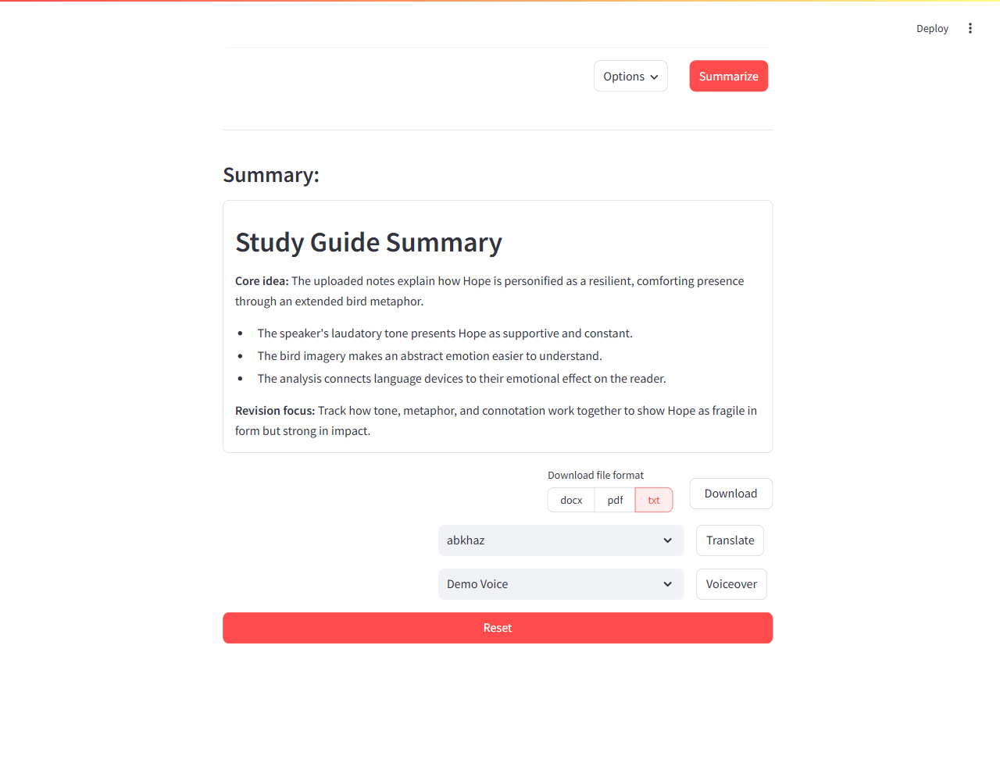
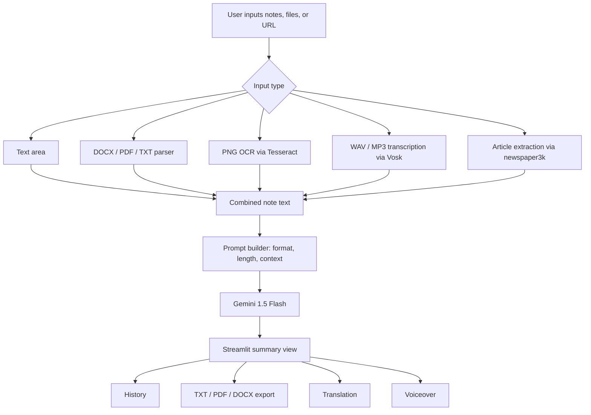

# Note Summarizer

A Streamlit app that turns notes, documents, webpages, images, and audio into configurable AI summaries with export, translation, and voiceover support.

## Overview

Note Summarizer is a first-place LLM workshop challenge project built for students, researchers, and knowledge workers who need to consolidate information from mixed sources into a cleaner summary. The app accepts direct text, uploaded files, and webpage URLs, normalizes them into text, sends the combined notes to Gemini 1.5 Flash, and lets users download, translate, replay, or revisit generated summaries.

The strongest engineering idea is the multi-source ingestion pipeline: document parsing, OCR, webpage extraction, and offline speech-to-text are handled before a single summarization workflow.

## Preview



Screenshot rendered locally with sample notes and a mocked Gemini response for README capture.

Demo video: [YouTube walkthrough](https://www.youtube.com/watch?v=LCSOp7c1UOI)

## Highlights

- Won 1st place in an LLM workshop challenge.
- Summarizes mixed input from typed notes, URLs, DOCX, PDF, TXT, PNG, WAV, and MP3 files.
- Uses Gemini 1.5 Flash with user-selectable summary style, length, and tone/context.
- Adds local extraction paths for OCR with Tesseract and audio transcription with an included Vosk model.
- Supports post-processing workflows: translation, text-to-speech voiceover, download, history, delete, and reset.
- Exports summaries as TXT, PDF, or DOCX from the same UI.

## Use Cases

| Use Case | User | Outcome |
| --- | --- | --- |
| Study material review | Student | Convert notes, slides exported as PDFs, screenshots, and recordings into a concise study guide. |
| Research triage | Researcher | Pull text from articles and documents, then generate short or long summaries by context. |
| Meeting recap | Team member | Transcribe an audio file, summarize it, and export the result for sharing. |
| Accessibility support | Reader/listener | Translate or play a generated summary with a local voice. |

## Features

**Input extraction**

- Direct note entry through a text area.
- Webpage extraction through `newspaper3k`.
- DOCX parsing with `python-docx`.
- PDF text extraction with `PyPDF2`.
- PNG OCR with `pytesseract`.
- WAV/MP3 transcription with `pydub`, FFmpeg, and Vosk.

**Summarization controls**

- Summary formats: paragraph, bullet points, or study guide.
- Summary lengths: short, medium, or long.
- Context styles: general, academic, business, or casual.
- Length warning for inputs above `16,000` characters.

**Output workflows**

- Summary history stored in Streamlit session state.
- Delete individual historical summaries.
- Download summaries as TXT, PDF, or DOCX.
- Translate summaries with `googletrans`.
- Generate voiceover playback with `pyttsx3`.

## Tech Stack

| Layer | Technology | Purpose |
| --- | --- | --- |
| UI | Streamlit | Interactive web app, tabs, uploads, controls, downloads, session state. |
| AI summarization | Google Generative AI SDK, Gemini 1.5 Flash | Generate structured summaries from normalized note text. |
| Web extraction | `newspaper3k`, `lxml_html_clean` | Download and parse article text from URLs. |
| Document parsing | `python-docx`, `PyPDF2` | Extract text from DOCX and PDF uploads. |
| OCR | Tesseract, `pytesseract`, Pillow | Extract text from PNG images. |
| Audio transcription | Vosk, `pydub`, FFmpeg | Convert audio to mono WAV and transcribe speech offline. |
| Translation | `googletrans` | Translate generated summaries. |
| Voiceover | `pyttsx3` | Play summaries using installed system voices. |
| Export | `fpdf`, `python-docx`, `PyPDF2` | Generate PDF, DOCX, and TXT downloads. |
| Configuration | `python-dotenv` | Load `API_KEY` from `.env`. |

## Architecture



## How It Works

1. The user enters notes, uploads one or more files, adds a webpage URL, or combines those sources.
2. `src/file.py` routes each input to the correct extractor and returns plain text.
3. `src/helpers.py` builds a prompt from the selected summary format, length, and context.
4. `app.py` sends the normalized notes to Gemini 1.5 Flash and stores the result in Streamlit session state.
5. The user can download the summary, translate it, play it as voiceover, or manage it from the history tab.

## Setup

### Prerequisites

- Python 3.12 was used in the checked-in bytecode cache; Python 3.10+ should be suitable for the listed libraries.
- A Google Gemini API key.
- Tesseract installed and available on `PATH` for PNG OCR.
- FFmpeg installed and available on `PATH` for MP3/WAV conversion.
- The included `model/` directory for Vosk speech recognition.

### Install

```powershell
python -m venv venv
.\venv\Scripts\activate
pip install -r requirements.txt
```

On macOS/Linux, activate the environment with:

```bash
source venv/bin/activate
```

Create a `.env` file in the project root:

```env
API_KEY=your_gemini_api_key_here
```

### Run Locally

```powershell
streamlit run app.py
```

Then open the local Streamlit URL shown in the terminal.

### Optional Windows Setup Notes

If PowerShell blocks virtual environment activation for the current session:

```powershell
Set-ExecutionPolicy Unrestricted -Scope Process
.\venv\Scripts\activate
```

Verify external tools:

```powershell
tesseract -v
ffmpeg -version
```

## Usage

1. Open the **Summarization** tab.
2. Upload files, paste notes, enter a webpage URL, or combine sources.
3. Open **Options** and choose summary style, length, and context.
4. Click **Summarize**.
5. Download the result as `txt`, `pdf`, or `docx`, or use translation and voiceover controls.
6. Open the **History** tab to revisit, export, or delete past summaries from the current session.

Sample inputs are available in [`testcontent/`](testcontent/).

## Key Decisions

| Decision | Rationale | Tradeoff |
| --- | --- | --- |
| Streamlit single-file app shell | Keeps the product easy to run and iterate while supporting uploads, controls, downloads, and session state. | UI and workflow logic are concentrated in `app.py`. |
| Normalized text pipeline | Lets every source type feed the same summarization function. | Extraction quality depends on the source format and external tools. |
| Local Vosk model for speech-to-text | Audio transcription can run without sending raw audio to a cloud transcription service. | The model adds repository weight and may be less accurate than larger hosted models. |
| Prompt options via enums | Summary style, length, context, and export formats are centralized in `src/constants.py`. | Adding new modes requires code changes rather than runtime configuration. |
| In-session history | Gives users lightweight recall without adding storage infrastructure. | History resets when Streamlit session state is cleared. |

## About

This project was built for an LLM workshop challenge and won 1st place by combining a practical summarization UX with a broader ingestion pipeline than plain text-only note tools.
